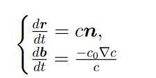
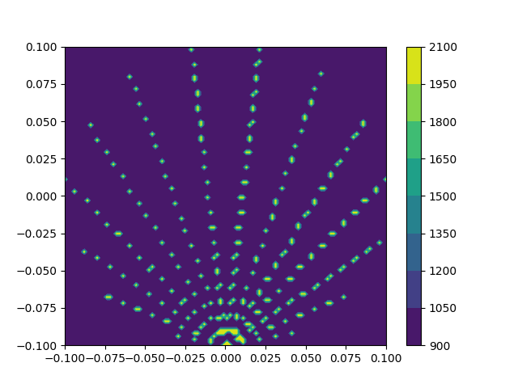
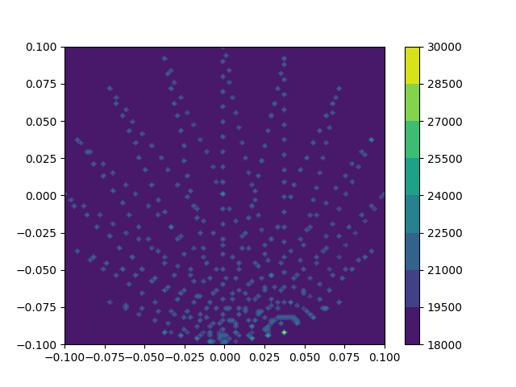
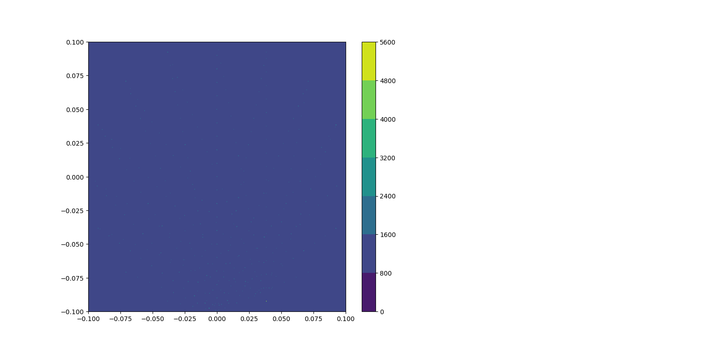

solving the system of vector equations  
  
First iteration of Levenberg -- Marquardt method with 100x100 nodes in grid and 16 sensors  
(input data is a column of ones)  
  
20-th iteration of Levenberg -- Marquardt method with 100x100 nodes in grid and 16 sensors  
(input data is a column of ones)  
  
First iteration of Levenberg -- Marquardt method with 1000x1000 nodes in grid and 16 sensors  
(input data is a column of ones)  
  
