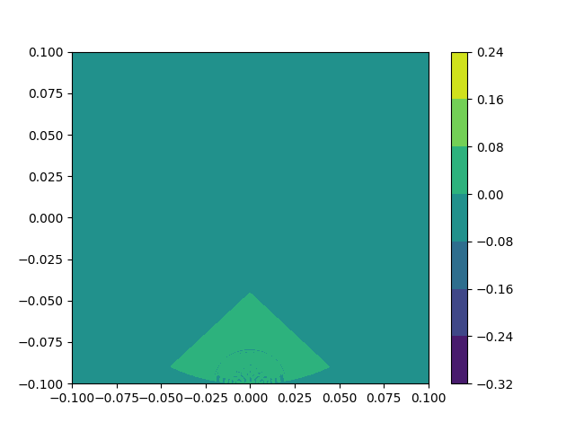
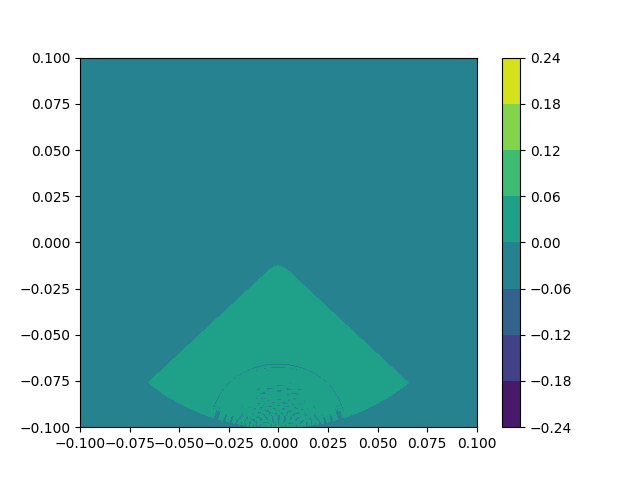
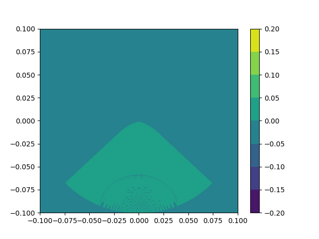
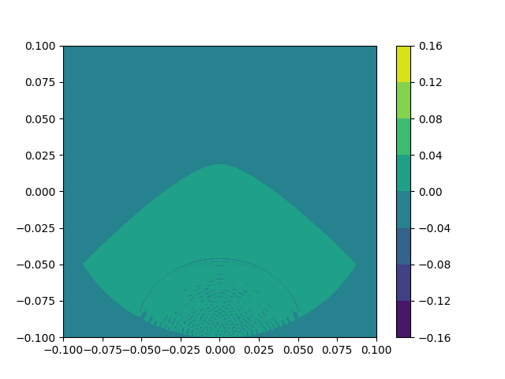
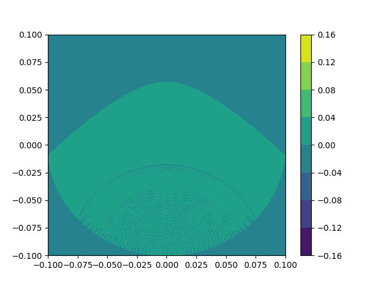
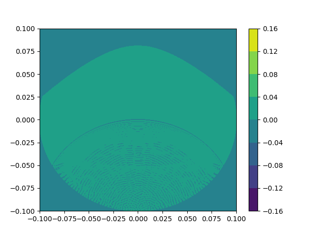
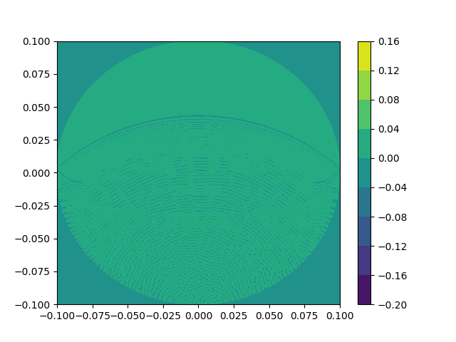
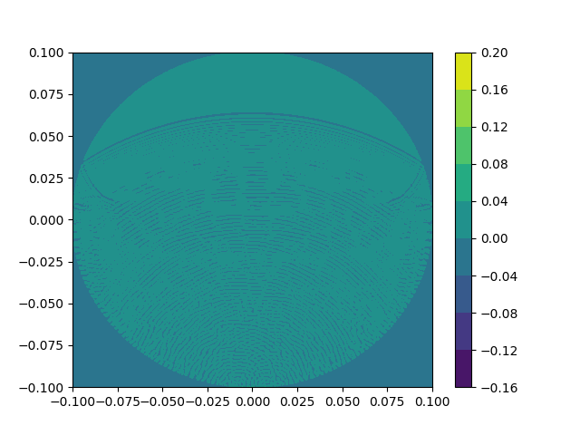

all moments on 1000x1000 grid  
1-st moment of solving  
  
2-nd moment of solving  
  
3-rd moment of solving  
  
4-th moment of solving  
  
5-th moment of solving  
  
6-th moment of solving  
  
7-th moment of solving  
  
8-th moment of solving  
  