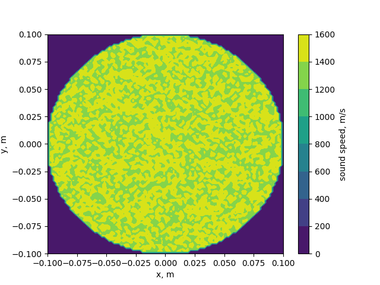

new approach:  
1. Jacob matrix performed as product multiplication u⊗v, so we don't need to have large matrixes  
2. using SPSA method for solve $$[J^{T}J+\lambda_kdiag(J^TJ)]x=-J^Tf_{ini}$$
water 100x100 grid 16 sensors  
  
one phantom 100x100 grid 16 sensors  
todo  
two phantoms 100x100 grid 16 sensors  
todo  
